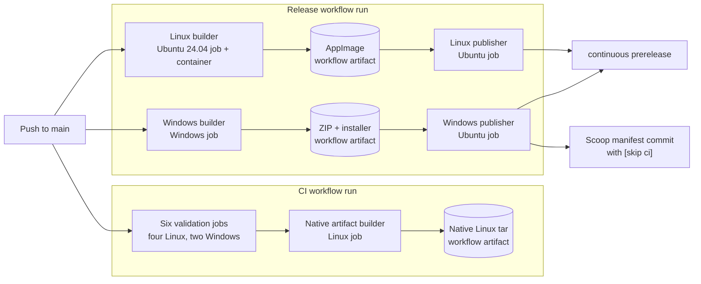

# GitHub Actions report: what a push to `main` does

**Repository:** `nexdep/syodep` (private)

**Snapshot date:** 2026-08-10

**Configuration update:** On 2026-08-26, the AppImage build userland moved from
Ubuntu 22.04 to Ubuntu 24.04. The observed timings, costs, and storage figures
below remain the 2026-08-10 snapshot.

**Observed push:** commit
[`94c82c2`](https://github.com/nexdep/syodep/commit/94c82c2d7d24040ddfb944052a5e5c6887ff2f5c),
an empty commit made specifically to exercise the pipeline after the account was
upgraded to GitHub Pro.

This report explains the current setup from first principles, records what the
test push actually did, and evaluates ways to make the workflow structure less
repetitive, cheaper, and easier to understand. It also explains what a local
Linux build would require and where it would, and would not, save time.

## Executive summary

A normal push to `main` starts two top-level workflow runs:

1. **CI** checks formatting, linting, Rust tests, documentation, and native Qt
   builds on Linux and Windows. After every check succeeds, it builds a Linux
   executable yet again and uploads a temporary tarball.
2. **Release** builds the distributable Linux AppImage and the Windows portable
   zip/installer. It then updates the two platform assets in the rolling
   `continuous` prerelease independently. Windows also commits an updated Scoop
   manifest back to `main` with `[skip ci]` in the message.

The third workflow file, **AppImage Build**, is a reusable Linux builder. On
`main` it is called from Release, so it appears as a job inside the Release run;
it does not create a third top-level run.

For the observed push:

- CI succeeded in **8m 39s**.
- Release succeeded in **7m 34s**.
- The Linux AppImage was public in the rolling prerelease after about **3m
  39s**.
- The Windows zip and Scoop update completed after about **7m 33s**.
- Eleven jobs actually ran; one tag-only publication job was correctly skipped.
- The jobs occupied runners for **25m 32s in aggregate**. Because GitHub rounds
  each job up to a whole minute for billing, this is approximately **15 Linux
  minutes plus 18 Windows minutes**, or 33 rounded runner-minutes.
- At the current standard private-runner list prices, that is about **$0.27 of
  gross compute** before the GitHub Pro allowance is applied. The observed
  account usage was discounted to a net charge of $0.
- The push created approximately **195 MiB** of temporary Actions artifacts.
- The repository currently has **351 active Actions artifacts occupying 20.3
  GiB**. GitHub Pro includes only **1 GB of Actions artifact storage**. Artifact
  retention is therefore the most urgent issue, even before compute
  deduplication.

The main structural duplication is that a `main` push builds the native Linux Qt
application three times and the native Windows Qt application twice. The best
long-term design is one orchestrating pipeline that runs validations once,
builds each platform deliverable once, and publishes those exact deliverables
only after the required checks pass.

## Pipeline at a glance



Rectangles inside the two large groups are jobs (or, for the Linux builder, a
reusable workflow presented as a job). Cylinders are temporary workflow
artifacts; the nodes at the far right are durable repository outputs. The CI
and Release runs start independently: each Release publisher waits for its own
platform builder, not for the CI workflow to finish.

## Beginner's glossary

### Git and GitHub terms

**Repository (repo)**
: The project folder tracked by Git, including its complete history and its
  GitHub page.

**Commit**
: A named snapshot of the repository. Its SHA is the long hexadecimal identity,
  such as `94c82c2d7d24040ddfb944052a5e5c6887ff2f5c`. The shorter `94c82c2` form is
  normally enough for humans.

**Branch**
: A movable name pointing to a sequence of commits. `main` is this repository's
  primary branch.

**Push**
: Sending local commits to GitHub. A `push` event can start GitHub Actions.

**Tag**
: A name intended to remain attached to a particular commit. Version tags such
  as `v0.16.0` create stable releases here. The `continuous` tag is deliberately
  movable and follows the latest rolling build.

### GitHub Actions terms

**Continuous integration (CI)**
: Automated checks run after changes. CI tries to prove that the code compiles,
  tests pass, formatting is correct, and documentation agrees with the code.

**Continuous delivery/deployment (CD)**
: Automation that packages validated code and makes it downloadable. In this
  repository, the Release workflow is the CD part.

**Workflow**
: One automation definition stored as YAML under `.github/workflows/`. A
  workflow says when it runs and which jobs it contains.

**Trigger / event**
: The occurrence that starts a workflow. Examples are a branch push, a pull
  request, a version tag, or a manual `workflow_dispatch` click.

**Workflow run**
: One execution of one workflow for one event. The test push created a CI run
  and a Release run.

**Job**
: A group of steps run on one fresh machine. Separate jobs normally have
  separate filesystems and may run in parallel.

**Builder**
: An informal name used in this report for a workflow or job whose main purpose
  is to compile and package a platform deliverable, such as the Linux AppImage
  or Windows zip and installer. A builder is not a special GitHub Actions
  primitive: it is still a workflow or job, and it runs on a runner. It is
  distinct from a publisher, which takes the builder's output and attaches it
  to a GitHub Release or updates a package manifest.

**Runner**
: The machine that executes a job. `ubuntu-24.04` and `windows-2022` select
  GitHub-hosted Linux and Windows virtual machines. A self-hosted runner is a
  machine supplied and maintained by the repository owner.

**Step**
: One ordered operation within a job, such as checking out the repository,
  restoring a cache, installing packages, or executing `cargo test`.

**Action**
: A reusable step supplied by GitHub or another maintainer. For example,
  `actions/checkout` downloads the selected commit and `actions/upload-artifact`
  stores build output.

**Reusable workflow**
: A complete workflow that another workflow can call as one job. This repository
  uses `.github/workflows/appimage.yml` this way.

**`needs` dependency**
: A declaration that one job must wait for other jobs. Without `needs`, jobs are
  eligible to run in parallel. With it, the downstream job normally runs only
  if all required jobs succeed.

**Condition (`if`)**
: A rule deciding whether a job or step should run. The versioned release job is
  present during a `main` push but skipped because its condition accepts only
  `v*` tags.

**Permission**
: What the workflow's temporary GitHub token may do. Most build jobs use
  `contents: read`. Only publication jobs get `contents: write`, which lets them
  move a tag, update a release, or push a manifest commit.

**Concurrency group**
: A named lane that prevents obsolete publication jobs from racing. With
  `cancel-in-progress: true`, a newer job in the same lane cancels the older
  one. The current configuration applies this only to the two final continuous
  publisher jobs, not to the expensive builds that precede them.

**Cache**
: Reusable intermediate data, such as compiled third-party Rust dependencies.
  A cache is an optimization: a correct job must still work when the cache is
  absent. `Swatinem/rust-cache` is used throughout this repository, especially
  to avoid rebuilding vendored MuPDF from scratch.

**Workflow artifact**
: A temporary file retained with a workflow run. Artifacts are useful for
  passing files between jobs or downloading a build for investigation. They
  count toward Actions artifact storage.

**Release asset**
: A file attached to a GitHub Release. The rolling AppImage and Windows zip are
  release assets. They are different from temporary workflow artifacts even
  though the release publisher obtains them from workflow artifacts first.

**Smoke test**
: A short end-to-end test proving the application can start and perform its most
  important basic operation. Here it opens a generated PDF, renders it, and
  paints a frame. It does not try to test every user feature.

**AppImage**
: A single-file Linux application bundle containing the syodep executable and
  most libraries it needs. This project intentionally bundles only Wayland Qt
  plugins and relies on a few host integration libraries such as glibc and
  graphics/font libraries.

**Portable Windows zip**
: A directory containing `syodep.exe`, Qt DLLs, plugins, license, README, and
  default configuration, compressed into a zip. It does not need an installer.

**NSIS installer**
: The Windows setup executable built from `packaging/syodep.nsi`. It installs the
  portable tree, creates shortcuts and registration entries, and can uninstall
  it again.

**Scoop manifest**
: A JSON recipe used by the Scoop Windows package manager. It contains the
  download URL, version, and checksum. When the continuous zip changes, CI must
  update the manifest so Scoop can detect and verify the new build.

## The three workflow definitions

The checked-in definitions are:

- [`.github/workflows/ci.yml`](../../.github/workflows/ci.yml)
- [`.github/workflows/release.yml`](../../.github/workflows/release.yml)
- [`.github/workflows/appimage.yml`](../../.github/workflows/appimage.yml)

Supporting release behavior also lives in
[`scripts/ensure-continuous-release.sh`](../../scripts/ensure-continuous-release.sh)
and is explained in [`docs/packaging.md`](../packaging.md).

### 1. CI

CI is triggered by:

- every branch push;
- every `v*` tag push; and
- every pull request.

Its workflow token has read-only repository contents permission. On a `main`
push it creates six independent validation jobs immediately, then one artifact
job after all six pass.

| Job | Runner | What it proves |
|---|---|---|
| Rust formatting and clippy | Ubuntu 24.04 | Rust is formatted; Clippy reports no warnings; the NSIS script compiles with warnings treated as errors; the SVG can produce a real icon. |
| Rust tests (Linux) | Ubuntu 24.04 | All workspace tests pass on Linux, including config, core, storage, PDF, and FFI behavior. |
| Rust tests (Windows) | Windows 2022 | The same Rust suite passes with the Windows/MSVC toolchain. |
| Qt shell build + smoke test (Linux) | Ubuntu 24.04 | CMake can link Rust and Qt; build identity is consistent; both OpenGL and raster renderers work under headless Wayland; invalid XCB use is rejected. |
| Qt shell build + smoke test (Windows) | Windows 2022 | The Rust static library and Qt shell build in Release mode and the real GUI executable opens/renders a PDF offscreen. |
| Documentation checks | Ubuntu 24.04 | Required documentation exists and command, binding, and configuration registries agree with the docs. |
| Build push artifact | Ubuntu 24.04 | After all preceding jobs pass, builds and smokes another native Linux executable, packages it with a version file and SHA-256 checksum, and uploads it for 14 days. |

`Build push artifact` is push-only, so it does not run for pull-request-only
events. Its `needs` list is the enforcement gate: a failed test, lint, docs, or
Qt job prevents the artifact build.

The resulting tarball is an unpackaged native Linux executable. It is not the
same thing as the AppImage: it does not bundle the Qt/runtime libraries needed
for broad distribution.

### 2. Release

Release is triggered by:

- a push to `main`;
- a `v*` tag push; or
- a manual `workflow_dispatch` run.

The trigger changes the build identity and publication behavior:

| Trigger | Build channel embedded in binaries | Publication |
|---|---|---|
| `main` push | `continuous` | Replace the two platform assets in the rolling `continuous` prerelease. |
| `v*` tag | `release` | Create a versioned GitHub Release with AppImage, Windows zip, and Windows installer. |
| Manual dispatch | `development` | Build workflow artifacts only; publish nothing. |

On a `main` push, Release starts the Linux and Windows builders in parallel.

#### Linux builder

`release-build-linux` calls the reusable AppImage workflow with the
`continuous` channel. The called job:

1. starts an Ubuntu 24.04 container on an Ubuntu 24.04 runner;
2. installs the compiler, Qt, Wayland, packaging, and test dependencies;
3. installs stable Rust;
4. restores cached Rust dependencies and native build outputs;
5. builds the Rust core and Qt shell in Release mode;
6. uses `linuxdeploy` and its Qt plugin to construct an AppImage;
7. removes XCB/offscreen plugins and verifies the intended Wayland libraries;
8. extracts and inspects the finished AppImage;
9. smoke-tests the actual AppImage with both OpenGL and raster renderers under
   headless Weston; and
10. uploads `syodep-x86_64-appimage` for 14 days.

Ubuntu 24.04 is the selected compatibility baseline. A Linux binary inherits a
minimum glibc version from the environment where it is built, so the AppImage
now requires glibc 2.39 or newer.

#### Windows builder

`release-build-windows`:

1. checks out the commit and restores Rust/Qt caches;
2. installs pinned Qt 6.7.3 and activates MSVC;
3. builds the Rust core and Qt shell in Release mode;
4. stages all needed DLLs with `windeployqt`;
5. verifies that the generated multi-resolution icon is real and nonblank;
6. removes Qt from `PATH` and smoke-tests the staged executable, proving the
   bundle is self-contained;
7. creates the portable zip;
8. compiles the NSIS installer;
9. performs a real silent install, executable smoke test, uninstall, data
   preservation check, and opt-in PDF association check; and
10. uploads one workflow artifact, `syodep-win64`, containing both the zip and
    installer.

The upload does not set `retention-days`, so GitHub applies the repository's
current default of 90 days.

#### Continuous publishers

The two publishers are siblings rather than a chain:

- `publish-continuous-linux` waits only for the AppImage build.
- `publish-continuous-windows` waits only for the Windows package build.

Each rechecks that its SHA is still the latest `origin/main`. A stale run skips
publication rather than overwriting a newer release. Each publisher also has a
separate concurrency group, so a newer Linux publication cancels an older Linux
publication without accidentally cancelling Windows, and vice versa.

Both use `scripts/ensure-continuous-release.sh`, which safely moves the
`continuous` tag, creates the prerelease if needed, and writes release notes
that warn that Linux and Windows may temporarily come from different commits.

The Linux publisher uploads only the renamed AppImage. The Windows publisher
uploads only the portable zip; it does not publish the continuously built
installer. It then calculates the zip checksum, changes
`bucket/syodep-continuous.json`, commits the manifest, rebases/retries if `main`
moved, and pushes the bot commit.

The bot message contains `[skip ci]`. This is essential: without it, the
manifest push to `main` would start Release again, which would publish another
zip, update the manifest again, and repeat forever.

#### Versioned publisher

`publish-release` is visible but skipped during a normal `main` push. It runs
only for a `v*` tag and waits for both platform builds. It attaches all three
versioned assets to a GitHub Release and commits the stable Scoop manifest bump
to `main`.

### 3. AppImage Build

AppImage Build has three entry paths:

- another workflow can call it through `workflow_call`;
- a person can start it manually; or
- a relevant feature-branch push can start it automatically.

Its standalone branch trigger watches changes under `crates/`, `ui-qt/`,
`packaging/`, `scripts/`, and `.github/workflows/`. It explicitly excludes
`main`, because Release already calls the exact same builder there. This avoids
building two byte-equivalent AppImages for one `main` push.

## What the observed `main` push did

The actual dependency graph was:

```text
push 94c82c2 to main
|
+-- CI run
|   +-- formatting/clippy/NSIS syntax --------+
|   +-- Rust tests Linux ---------------------+
|   +-- Rust tests Windows -------------------+
|   +-- Qt build/smoke Linux -----------------+--> native Linux tar artifact
|   +-- Qt build/smoke Windows ---------------+
|   +-- documentation checks -----------------+
|
+-- Release run
    +-- reusable AppImage build --> publish Linux continuous asset
    +-- Windows package build ---> publish Windows continuous asset
                                  +--> commit continuous Scoop manifest [skip ci]
    +-- versioned-release publisher: skipped (not a tag)
```

The successful runs are:

- [CI run 31404730870](https://github.com/nexdep/syodep/actions/runs/31404730870)
- [Release run 31404733751](https://github.com/nexdep/syodep/actions/runs/31404733751)
- [Rolling continuous prerelease](https://github.com/nexdep/syodep/releases/tag/continuous)

### Observed job timings and approximate billable minutes

GitHub bills each completed job separately and rounds a partial minute upward.
Parallel jobs shorten the human wait, but they do not erase one another's runner
usage.

| Workflow / job | OS | Actual job time | Rounded minutes |
|---|---:|---:|---:|
| CI: documentation | Linux | 0m 04s | 1 |
| CI: Rust tests | Linux | 0m 47s | 1 |
| CI: formatting, Clippy, NSIS syntax | Linux | 0m 50s | 1 |
| CI: Qt shell build/smoke | Linux | 2m 09s | 3 |
| CI: final push artifact | Linux | 2m 08s | 3 |
| CI: Rust tests | Windows | 2m 17s | 3 |
| CI: Qt shell build/smoke | Windows | 6m 16s | 7 |
| Release: AppImage build | Linux | 3m 17s | 4 |
| Release: Linux publisher | Linux | 0m 16s | 1 |
| Release: Windows publisher | Linux | 0m 13s | 1 |
| Release: Windows package/installer build | Windows | 7m 15s | 8 |
| **Total** |  | **25m 32s of runner occupancy** | **15 Linux + 18 Windows = 33** |

At the 2026-08-10 standard rates of $0.006 per Linux minute and $0.010 per
Windows minute, the rounded list-price equivalent is:

```text
15 x $0.006 + 18 x $0.010 = $0.27 per equivalent main push
```

This is not an additional charge while the account's included usage covers it.
GitHub Pro currently includes 3,000 Actions minutes per month for private
repositories. The important distinction is that the 8m 39s seen by a person is
wall-clock latency, while the approximately 33 rounded minutes are what the
parallel jobs collectively consume.

### Artifacts created by this push

| Stored object | Contents | Size | Retention / lifetime |
|---|---|---:|---|
| `syodep-linux-x86_64-<full SHA>` | Native Linux tarball + checksum | 56.5 MiB | 14 days |
| `syodep-x86_64-appimage` | AppImage passed to publisher/downloadable from the run | 33.3 MiB | 14 days |
| `syodep-win64` | Portable zip + installer | 105.5 MiB | 90-day repository default |
| `syodep-continuous-x86_64.AppImage` | Rolling Linux release asset | 33.8 MiB | Replaced by a newer successful Linux publication |
| `syodep-continuous-win64.zip` | Rolling Windows release asset | 58.4 MiB | Replaced by a newer successful Windows publication |

The first three are Actions workflow artifacts and total about 195 MiB for this
one push. The last two are the public-facing files on the rolling prerelease.

### Current artifact-storage snapshot

The Actions API reported, on 2026-08-10:

- 371 artifact records in total;
- 351 not yet expired;
- 20.3 GiB occupied by active artifacts;
- 110 active `syodep-win64` artifacts using 10.1 GiB; and
- 131 active AppImage artifacts using 4.25 GiB.

The remainder is mostly per-SHA native Linux tarballs and older artifact names.
Older artifacts retain the expiry assigned when they were created; adding a
shorter YAML retention later does not retroactively shorten them.

GitHub Pro includes 1 GB of Actions artifact storage. Storage accrues in
GB-hours, so deleting old artifacts stops future accrual but does not erase
storage already accrued earlier in the billing period.

## Where work is duplicated

### Linux is built repeatedly

During one `main` push, the Rust/Qt application is compiled in three separate
Linux deliverable jobs:

1. CI's Qt build/smoke job;
2. CI's final native-tar artifact job; and
3. Release's AppImage job.

Clippy and Linux tests also compile much of the Rust dependency graph in two
additional isolated jobs. Caches make these compilations shorter, but each job
still restores a cache, installs native packages, and performs work that another
job cannot directly reuse.

### Windows is built twice

CI builds and smokes the Windows Qt application. Release separately builds the
same commit, stages it, smokes the staged tree, builds the installer, and tests
install/uninstall. The release job's staged-bundle test is stronger than the
plain CI shell smoke test, so both full Qt builds are not necessary on `main` if
the release job is made part of the same required gate.

The independent Windows Rust test still has value: compiling the application is
not the same as executing all unit and integration tests.

### Two Linux deliverable formats overlap

The CI tarball and Release AppImage both provide a Linux executable. The
AppImage is the supported distributable and has much stronger bundle validation.
The raw tarball primarily exists to satisfy the policy that every push leaves an
artifact after all checks. On `main`, the Release run already leaves an AppImage
artifact for the same SHA.

### Every `main` push is treated as binary-relevant

There is no path/change filter on CI or Release for `main`. Documentation-only
changes and even the empty test commit rebuild every platform and installer.
This is consistent with the current policy that every push produces artifacts
and every continuous binary embeds the pushed commit SHA. Changing it would be a
product-policy decision, not merely a YAML cleanup.

### Stale builds are cancelled too late

Only the final continuous publishers have concurrency cancellation. If three
commits are pushed rapidly, older Linux/Windows builds may run to completion and
only then discover that they are stale. Workflow-level concurrency could cancel
those expensive obsolete builds much earlier.

### Artifact retention is much longer than its purpose requires

Workflow artifacts are needed for minutes while publisher jobs download them.
Keeping every Windows zip and installer for 90 days is unnecessary when the
latest rolling zip is already a release asset and versioned release assets are
permanent on their GitHub Release.

## Rationalization avenues

### Priority 1: repair artifact retention

This is the highest-return, lowest-risk work.

1. Set an explicit short `retention-days` on `syodep-win64`, preferably 7 or 14
   days initially. Do not rely on the repository default.
2. Consider 3-7 days for continuous/transfer artifacts. They are mainly useful
   for debugging recent failures; the rolling release preserves the successful
   user-facing files.
3. Upload the NSIS installer artifact on tag/manual builds only. Continue to
   build and test it on `main` if that regression coverage is desired, but the
   continuous publisher consumes only the zip.
4. Remove or shorten the native Linux tarball on `main`, where the AppImage
   already represents the same commit. It could remain on feature pushes if a
   cheap native artifact is still useful there.
5. After deciding what must be retained, delete old workflow artifacts. This is
   a separate destructive maintenance action and should preserve any builds
   still needed for investigation. It immediately reduces current storage but
   cannot reverse already accrued GB-hours.

At one `main` push per day, today's retention settings alone tend toward roughly
10 GiB of stored artifacts: about 90 days of 105.5 MiB Windows artifacts plus 14
days of the two Linux artifacts. Multiple pushes and historical 90-day AppImage
retention explain why the current snapshot is higher.

### Priority 2: cancel superseded runs at workflow level

Add a workflow-level concurrency group keyed by workflow and ref, with
`cancel-in-progress` enabled for `main` but not version tags. Conceptually:

```yaml
concurrency:
  group: ${{ github.workflow }}-${{ github.ref }}
  cancel-in-progress: ${{ github.ref == 'refs/heads/main' }}
```

This does not make one isolated push faster. It prevents obsolete pushes from
continuing to consume minutes when a newer `main` commit has already replaced
them. Versioned tag runs must not be cancellable this way because each tag is a
distinct promised release.

### Priority 3: build each platform deliverable once

Create one top-level pipeline for the events that can publish. Reusable workflow
files may remain, but one orchestrator should own dependencies and publication.
A sensible graph is:

```text
                    +--> Linux validation --------+
push / PR / tag ----+--> Windows Rust tests ------+--> required gate
                    +--> Linux AppImage build ----+
                    +--> Windows package build ---+

required gate + Linux package  ---> Linux publisher when applicable
required gate + Windows package --> Windows publisher when applicable
```

Under this design:

- the AppImage build replaces CI's native Linux Qt build/smoke on `main`;
- the staged Windows release build replaces CI's native Windows Qt build/smoke
  on `main`;
- the native Linux tar build is removed on `main`;
- Linux tests, Windows tests, Clippy, documentation checks, build-identity
  tests, and early NSIS syntax validation remain;
- missing checks unique to the old native smoke job, such as the database-path
  assertion, are moved into the packaged smoke test before the old job is
  removed; and
- publishers depend on validations as well as their own package, so red code is
  never promoted.

The package jobs can run in parallel with validation for minimum latency, while
publication waits for the gate. The tradeoff is that a failed run may still
create a short-lived internal artifact. If the hard rule is interpreted to mean
that no artifact may exist before validation succeeds, put package jobs after
the gate instead; that saves the same compute but adds roughly the validation
time to every green release.

Based on the observed run, removing the duplicate Linux Qt job, Windows Qt job,
and native Linux artifact build eliminates about **10m 33s of raw runner
occupancy**. Combining Linux formatting, Clippy, tests, docs, and NSIS syntax on
one runner would also reuse setup/cache work and reduce per-job rounding.

A realistic target is approximately:

- **15 minutes of raw runner occupancy instead of 25m 32s**;
- about **19 rounded job-minutes instead of 33**, depending on the exact merged
  validation duration;
- roughly **$0.16 rather than $0.27** in gross list-price equivalent; and
- no worse wall-clock publication time if package builds remain parallel with
  validation. CI's final completion should improve by roughly the current
  post-gate artifact job, about one minute on the observed critical path.

These are estimates from the recorded timings, not guarantees. Cache hits,
runner availability, and network speed vary.

### Priority 4: merge small Linux validation jobs

Formatting, Clippy, Linux tests, docs, and NSIS syntax currently start separate
Ubuntu machines. Putting them in one Linux validation job would:

- check out once;
- restore one Rust cache;
- install native packages once;
- let `cargo test` reuse compilation performed by `clippy --all-targets`; and
- avoid rounding several sub-minute jobs to a full minute each.

The disadvantages are less parallelism and a less granular job overview. Named
steps still make the failure location clear. Since the observed jobs were 4s,
47s, and 50s, the reduced setup and billing overhead is likely worth the small
loss of parallelism.

### Priority 5: optionally skip binary work for non-binary changes

A small initial job can compare the pushed commit with its parent and classify
whether build-relevant files changed. Heavy jobs could be skipped for changes
limited to documentation or bucket manifests while a stable `pipeline` check
still reports success.

This would have avoided all heavy work for the empty test commit. It also has
real semantic consequences:

- no new binary would carry that commit's SHA;
- the rolling `continuous` tag/assets would remain on the previous code-bearing
  commit; and
- the AGENTS.md rule saying every push produces an artifact would need to be
  revised deliberately.

Use a successful classification/gate job rather than relying only on top-level
`paths-ignore`; otherwise branch protection can wait forever for a required
check that GitHub never created.

### Lower-value ideas

**Centralize repeated setup**
: A local composite action or reusable workflow can hold the repeated Rust,
  cache, Qt, and apt setup. This mainly reduces YAML drift; isolated jobs still
  pay for separate machines and installs.

**Prebuilt Linux build container**
: A maintained image could avoid the AppImage job's 65-second apt install and
  9-second Rust install, but image build/updates, registry storage, and pulls add
  maintenance. It is not the first optimization while entire duplicate builds
  remain.

**Keep early NSIS syntax validation**
: It looks duplicate because the Windows release job builds the real installer,
  but it catches script errors in about a minute of job time instead of after a
  seven-minute Windows build. Its actual compile step took about one second, so
  it is useful fail-fast coverage.

**Make the repository public**
: Standard hosted-runner compute is free for public repositories, but repository
  visibility is a product/security decision and should never be changed merely
  as a workflow optimization.

## Local Linux builds

### Two different goals

“Build Linux locally” can mean two different things:

1. build a native executable for immediate development/testing on this machine;
2. build the distributable AppImage that CI publishes.

The first is straightforward and useful. The second must reproduce the older
container and packaging checks to remain portable.

### Native local executable: requirements

The current machine is x86-64 Ubuntu 26.04 under a Microsoft hypervisor, with 6
physical/12 logical CPU threads and about 8 GiB RAM. Stable Rust is installed
and the existing Cargo target cache occupies about 3.4 GiB. The following tools
were missing when this report was written: CMake, Ninja, Qt's `qmake6`, Weston,
Clang, and `pkg-config`.

For Ubuntu/Debian, install:

```bash
sudo apt update
sudo apt install build-essential clang libclang-dev pkg-config \
    cmake ninja-build qt6-base-dev libqt6opengl6-dev qt6-wayland \
    libgl1-mesa-dev libfontconfig1-dev libfreetype-dev weston
```

Then build an optimized development-channel executable:

```bash
cmake -B build -G Ninja \
    -DCMAKE_BUILD_TYPE=Release \
    -DSYODEP_BUILD_CHANNEL=development
cmake --build build
./build/ui-qt/syodep --version
```

Run the same Linux smoke coverage:

```bash
cargo run -p syodep-pdf --features test-support \
    --example make_fixture -- /tmp/syodep-fixture.pdf 5
bash scripts/with-headless-wayland.sh \
    ./build/ui-qt/syodep --renderer=opengl \
    --smoke-test /tmp/syodep-fixture.pdf
bash scripts/with-headless-wayland.sh \
    ./build/ui-qt/syodep --renderer=raster \
    --smoke-test /tmp/syodep-fixture.pdf
```

The first clean Rust build compiles vendored MuPDF and can take roughly five
minutes, as already noted in the repository instructions. Later incremental
builds should be much faster. The hosted AppImage job's cached compile step was
50 seconds; a warm local native build avoids runner startup, apt, rustup, cache
download, AppImage packaging, and artifact upload, so tens of seconds to a
couple of minutes is a reasonable expectation. It should be measured after the
one-time dependency installation rather than treated as a promise.

### Would a native local build save time?

**Yes, for developer feedback.** It can reveal compilation or smoke-test errors
before a push and can be repeated incrementally without waiting for GitHub.

**No, for the current GitHub pipeline.** Pushing after a local build still
starts all the same hosted jobs. GitHub has no evidence that a command succeeded
on a developer machine, and local build files are not automatically transferred
to clean runners.

Local pre-push checks therefore save human iteration time but do not reduce
Actions minutes unless the YAML is changed to omit hosted checks—which is not
recommended merely because a developer says a local build passed.

### Why the native Ubuntu 26.04 binary should not be published

A normal native build links against the local distribution's glibc, Qt, and
other system libraries. Building on Ubuntu 26.04 can make the result unusable on
Ubuntu 24.04 or other supported distributions with the same runtime baseline.

The official AppImage deliberately builds inside Ubuntu 24.04, bundles selected
Qt/Wayland libraries, removes unsafe/unwanted plugins, fixes an internal
`RUNPATH`, checks host-library boundaries, extracts the result, and smoke-tests
the actual package. A bare local `cmake --build` does none of that packaging.

### Building the AppImage locally

To reproduce the distributable locally, use Docker or Podman and mirror the
Ubuntu 24.04 container job in `.github/workflows/appimage.yml`. The machine
needs:

- Docker/Podman capable of running an x86-64 Ubuntu 24.04 container;
- the source checkout mounted into the container;
- internet access for apt, rustup, Cargo, linuxdeploy, and the Qt linuxdeploy
  plugin;
- a persistent Cargo cache/target directory if repeated builds should be fast;
- sufficient disk for the container, packages, the existing multi-gigabyte Rust
  target tree, AppDir, extracted AppImage, and final package; and
- Weston/software OpenGL support for both packaged smoke tests.

A clean local AppImage build is unlikely to beat the observed 3m 17s hosted job
because the hosted job already had a warm Rust cache. A persistent local setup
may beat it on repeated builds, but the benefit is primarily faster iteration,
not a more trustworthy release.

### Self-hosted runner option

A self-hosted runner is the only normal way for a local machine to execute jobs
that GitHub recognizes as part of the workflow. The setup would require:

1. registering a dedicated Linux runner in repository settings;
2. installing the GitHub runner service and keeping it online and updated;
3. installing Docker, because the AppImage job requires an Ubuntu 24.04
   container;
4. giving it a label such as `syodep-linux` and changing selected `runs-on`
   declarations;
5. preserving or deliberately clearing build caches; and
6. securing the machine against workflow code, dependencies, and secrets.

Self-hosted runner minutes are free, but uploaded workflow artifacts still
consume Actions storage. A single local runner also executes only one job at a
time unless multiple runner instances are configured, so moving every Linux job
to one machine could increase wall-clock time compared with today's GitHub
parallelism.

If this route is ever needed, the safer split is:

- run the read-only AppImage builder on a dedicated, disposable self-hosted
  runner;
- upload its artifact;
- keep the small write-permission publisher on a GitHub-hosted runner; and
- never expose a personal workstation containing unrelated credentials or files
  as a general-purpose runner.

With GitHub Pro currently covering the compute and the workflow still carrying
large structural duplication, maintaining a self-hosted runner is not yet worth
the operational and security cost. Fixing artifact retention and duplicate
hosted builds comes first.

### Recommendation for local work

Use local native builds for normal development and run the full local pre-push
checks required by `AGENTS.md`. Keep a reproducible hosted/container AppImage as
the release authority. Do not manually upload a native Ubuntu 26.04 binary as a
replacement for the CI artifact.

## Recommended implementation order

1. **Retention-only patch:** set explicit short retention on Windows and review
   all upload steps.
2. **Artifact cleanup:** after selecting what must be preserved, delete old
   temporary artifacts to bring the current 20.3 GiB inventory down.
3. **Concurrency patch:** cancel superseded CI and main-release builds before
   they finish.
4. **Remove the redundant native Linux artifact on `main`:** treat the AppImage
   workflow artifact as the required main-push Linux artifact; update
   `AGENTS.md`, packaging docs, testing docs, and the development log together.
5. **Unify main orchestration:** reuse one AppImage build and one Windows
   package build as the platform Qt gates, preserving every unique assertion.
6. **Merge small Linux validation jobs:** share checkout, apt, and Cargo cache
   work.
7. **Decide the policy for docs-only/empty commits:** only then add change-based
   skipping.
8. **Install local native build prerequisites:** use them for feedback, not as a
   substitute for reproducible release packaging.

## Sources and audit trail

Repository sources:

- [`ci.yml`](../../.github/workflows/ci.yml)
- [`release.yml`](../../.github/workflows/release.yml)
- [`appimage.yml`](../../.github/workflows/appimage.yml)
- [`ensure-continuous-release.sh`](../../scripts/ensure-continuous-release.sh)
- [`docs/packaging.md`](../packaging.md)
- [`docs/testing.md`](../testing.md)
- [`AGENTS.md`](../../AGENTS.md)

GitHub references:

- [Understanding GitHub Actions](https://docs.github.com/en/actions/about-github-actions/understanding-github-actions)
- [Workflow syntax](https://docs.github.com/en/actions/using-workflows/workflow-syntax-for-github-actions)
- [Workflow artifacts](https://docs.github.com/en/actions/concepts/workflows-and-actions/workflow-artifacts)
- [GitHub Actions billing](https://docs.github.com/en/billing/concepts/product-billing/github-actions)
- [Usage included with GitHub plans](https://docs.github.com/en/billing/reference/product-usage-included)
- [Actions runner pricing](https://docs.github.com/en/billing/reference/actions-runner-pricing)
- [Self-hosted runner reference](https://docs.github.com/en/actions/reference/runners/self-hosted-runners)

Timing, job, artifact, and release-asset figures came from the GitHub Actions
and Releases APIs for runs 31404730870 and 31404733751. Repository-wide artifact
counts and sizes came from the paginated Actions artifacts API on 2026-08-10.
