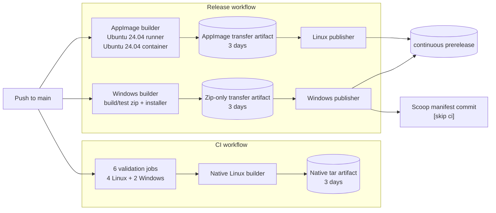

# GitHub Actions report: what a push to `main` does

**Repository:** [`nexdep/syodep`](https://github.com/nexdep/syodep) (public)

**Snapshot date:** 2026-08-26

**Observed green push:** commit
[`8cd0256`](https://github.com/nexdep/syodep/commit/8cd0256fcf2ca05ee9619ab73515cab7a0e91af4),
which contains the Rust 1.98 lint correction on top of the Ubuntu 24.04 and
artifact-retention implementation.

This report explains the pipeline from first principles, records what the live
push did, and measures the completed Priority 1 storage work. Times are UTC and
sizes from the Actions API are stored-byte sizes unless stated otherwise.

## Executive summary

A push to `main` starts two top-level workflows:

1. **CI** runs six validation jobs. Only after all six pass does a seventh job
   rebuild and smoke-test a native Linux package, then upload it.
2. **Release** starts the Linux AppImage and Windows package builders in
   parallel. Each successful builder feeds its own rolling-release publisher.
   The Windows publisher also commits the updated continuous Scoop manifest
   back to `main` with `[skip ci]`.

The separate **AppImage Build** workflow is reusable. On `main`, Release calls
it as a nested job; it does not start a third top-level run.

For the observed green push:

- [CI run 32995413552](https://github.com/nexdep/syodep/actions/runs/32995413552)
  succeeded in **12m 54s**.
- [Release run 32995414281](https://github.com/nexdep/syodep/actions/runs/32995414281)
  succeeded in **4m 36s**.
- The rolling AppImage was replaced about **3m 27s** after the push; the
  Windows zip followed at about **4m 29s**.
- Eleven jobs ran and one tag-only publication job was skipped.
- Jobs occupied runners for **27m 26s** in aggregate. Per-job rounding gives
  **21 Linux minutes + 13 Windows minutes = 34 runner-minutes**.
- The standard private-runner list-price equivalent is about **$0.26**, but
  standard GitHub-hosted compute is free and unlimited here because the
  repository is public.
- The push created **149.95 MiB** of workflow artifacts, all with three-day
  expiry.
- The Windows workflow artifact fell from roughly **105.5 MiB** for the former
  zip-plus-installer object to **58.34 MiB** for the zip-only transfer object.
  The installer is still built and tested end to end.
- Historical cleanup deleted **378 of 381** known workflow artifacts,
  releasing **21.748 GiB**. The newest member of each known family and every
  GitHub Release asset were preserved.

Priority 1 is complete. The largest remaining design concern is correctness,
not storage: Release publishers do not wait for CI. The first two live
verification commits proved this by publishing their packages even though
their independent CI runs failed a newly introduced Rust 1.98 Clippy lint. The
latest rolling assets now come from the green observed commit.

## Pipeline at a glance

The easiest mental model is three layers:

1. **validation** proves the source tree is acceptable;
2. **builders** compile, package, and smoke-test deliverables; and
3. **publishers** copy tested packages to durable release channels.



Rectangles are jobs or reusable builders. Cylinders are stored objects. The
three temporary workflow artifacts are intentionally short-lived; the
`continuous` release assets are the durable user-facing downloads.

The CI and Release groups are independent. A builder failure blocks its own
publisher, but a CI failure does not currently block either Release publisher.

## Beginner's glossary

**Workflow**
: A YAML automation definition under `.github/workflows/`.

**Workflow run**
: One execution of one workflow for one event. A normal `main` push creates a
  CI run and a Release run.

**Job**
: A set of ordered steps executed on one fresh runner. Separate jobs have
  separate filesystems and can run in parallel.

**Step**
: One operation inside a job, such as checkout, cache restore, `cargo test`, or
  artifact upload.

**Runner**
: The machine that executes a job. This project uses standard
  `ubuntu-24.04` and `windows-2022` GitHub-hosted runners.

**Container**
: An additional userspace started inside a runner. The AppImage job uses an
  Ubuntu 24.04 container on an Ubuntu 24.04 runner. The container, not merely
  the runner, determines the Linux libraries against which the package builds.

**Builder**
: This report's informal name for a workflow or job whose main purpose is to
  compile, package, and validate a deliverable. “Builder” is not a GitHub
  Actions primitive; it is still a workflow or job running on a runner.

**Publisher**
: A job that takes a builder's tested output and attaches it to a GitHub
  Release or updates a package-manager manifest. It should do little or no
  compilation.

**Reusable workflow**
: A workflow callable from another workflow as one job. `appimage.yml` is the
  reusable Linux package builder.

**`needs` dependency**
: A rule that makes one job wait for named jobs and normally requires them to
  succeed.

**Condition (`if`)**
: A rule that decides whether a job or step runs. The versioned publisher is
  visible on `main` but skipped because `main` is not a `v*` tag.

**Cache**
: Reusable intermediate data, such as compiled third-party Rust dependencies.
  It improves speed but is not a deliverable.

**Workflow artifact**
: A temporary file associated with a workflow run. Artifacts can pass output
  between jobs or support recent debugging, and they consume Actions storage.

**Release asset**
: A user-facing file attached to a GitHub Release. It is distinct from a
  workflow artifact even when a publisher obtains it from one.

**Smoke test**
: A short end-to-end check that starts the actual application, opens a
  generated PDF, renders it, and paints a frame.

**AppImage**
: The supported single-file Linux package. It bundles the application and
  selected Qt/Wayland libraries while relying on deliberate host-library
  boundaries.

**Portable Windows zip**
: `syodep.exe`, Qt DLLs, plugins, documentation, and configuration compressed
  into a package that needs no installer.

**NSIS installer**
: The Windows setup executable produced from `packaging/syodep.nsi`. CI
  installs, launches, and uninstalls it to test its real behavior.

**Scoop manifest**
: A JSON package recipe containing a download URL, version, and checksum. The
  Windows publisher updates it whenever the continuous zip changes.

## Workflow definitions

The checked-in definitions are:

- [`.github/workflows/ci.yml`](../../.github/workflows/ci.yml)
- [`.github/workflows/release.yml`](../../.github/workflows/release.yml)
- [`.github/workflows/appimage.yml`](../../.github/workflows/appimage.yml)

Supporting release behavior lives in
[`scripts/ensure-continuous-release.sh`](../../scripts/ensure-continuous-release.sh)
and is specified in [`docs/packaging.md`](../packaging.md).

### CI

CI runs for every branch push, `v*` tag push, and pull request. On a `main`
push, six validation jobs start independently:

| Job | Runner | Purpose |
|---|---|---|
| Rust formatting and Clippy | Ubuntu 24.04 | Formatting, warning-free Rust, early NSIS syntax, and icon generation. |
| Rust tests | Ubuntu 24.04 | Full Rust workspace tests on Linux. |
| Rust tests | Windows 2022 | Full Rust workspace tests with MSVC. |
| Qt shell build + smoke | Ubuntu 24.04 | Native Qt/Rust build and real OpenGL/raster Wayland smokes. |
| Qt shell build + smoke | Windows 2022 | Native Windows Qt/Rust build and offscreen PDF render smoke. |
| Documentation checks | Ubuntu 24.04 | Required pages plus command, binding, config, packaging, and retention invariants. |

`Build push artifact` waits for all six. It rebuilds and smokes the native
Linux application, packages the executable, version marker, and checksum, and
uploads `syodep-linux-x86_64-<SHA>`.

The native tar is not the supported AppImage. It exists to satisfy the project
policy that every successful push leaves a post-gate artifact. It now expires
after three days on `main` and seven days elsewhere.

### Release

Release runs on a `main` push, a `v*` tag push, or manual dispatch:

| Trigger | Embedded channel | Publication |
|---|---|---|
| `main` push | `continuous` | Replace the rolling AppImage and Windows zip independently. |
| `v*` tag | `release` | Create a versioned release with AppImage, zip, and installer. |
| Manual dispatch | `development` | Build seven-day workflow artifacts only. |

#### Linux builder

The Release job calls the reusable AppImage workflow. It now:

1. starts an Ubuntu 24.04 container on an Ubuntu 24.04 runner;
2. installs distro Qt, Wayland, compiler, packaging, and test dependencies;
3. installs stable Rust and restores the Ubuntu-24.04-specific Rust cache;
4. builds the Rust core and Qt shell in Release mode;
5. packages with `linuxdeploy` and the Qt plugin;
6. removes unwanted XCB/offscreen plugins and checks library boundaries;
7. extracts the finished AppImage; and
8. smoke-tests the actual package with OpenGL and raster renderers under
   Weston.

Aligning runner and container at 24.04 makes the build environment easier to
reason about, but it deliberately raises the AppImage runtime floor. Ubuntu
24.04 supplies glibc 2.39, so the published package requires glibc 2.39 or
newer. This compatibility choice is documented in the
[`README`](../../README.md), packaging specification, roadmap, workflow
comments, and enforced docs check.

#### Windows builder

The Windows job builds the Qt shell, stages the portable tree with
`windeployqt`, smoke-tests it with Qt removed from `PATH`, creates the zip,
builds the NSIS installer, then performs a real silent install/smoke/uninstall
cycle including data-preservation and opt-in PDF-association checks.

On `main`, only `syodep-win64.zip` is uploaded as the three-day
`syodep-win64` transfer artifact. Tag and manual runs upload the zip and
`syodep-setup.exe` for seven days. Tagged releases still publish the installer
permanently.

The observed artifact was downloaded and inspected: it contained exactly one
file, `syodep-win64.zip` (61,219,765 bytes), and no installer.

#### Publishers

The Linux and Windows continuous publishers are siblings. Each waits only for
its own builder, checks that the SHA is still the tip of `main`, and replaces
its platform asset in the
[`continuous` prerelease](https://github.com/nexdep/syodep/releases/tag/continuous).

The Windows publisher also updates `bucket/syodep-continuous.json`. Its commit
contains `[skip ci]`, preventing a publication loop.

The versioned publisher is skipped on `main`. It runs only for `v*` tags and
attaches all three packages to a stable GitHub Release.

### Standalone AppImage Build

AppImage Build may be called by Release, started manually, or triggered by
relevant changes on a feature branch. Its branch trigger excludes `main`
because Release already calls exactly the same builder there.

Standalone branch, tag, and manual artifacts expire after seven days. The
called `main` artifact expires after three.

## What the observed green push did

The dependency graph was:

```text
push 8cd0256 to main
|
+-- CI run 32995413552
|   +-- six validations ----------------------+
|                                             +--> native Linux tar (3 days)
|
+-- Release run 32995414281
    +-- Ubuntu 24.04 AppImage --> Linux continuous asset
    +-- Windows zip + tested installer
        +-- zip-only artifact --> Windows continuous asset
                              +--> Scoop manifest [skip ci]
    +-- versioned publisher: skipped
```

All non-skipped jobs succeeded.

### Job timings

GitHub rounds each job independently when calculating private-repository minute
usage. Parallel jobs reduce human wait but not aggregate runner occupancy.

| Workflow / job | Runner OS | Actual time | Rounded minutes |
|---|---:|---:|---:|
| CI: documentation | Linux | 0m 07s | 1 |
| CI: Rust tests | Linux | 0m 34s | 1 |
| CI: formatting, Clippy, NSIS syntax | Linux | 2m 47s | 3 |
| CI: Qt shell build/smoke | Linux | 1m 23s | 2 |
| CI: final push artifact | Linux | 8m 35s | 9 |
| CI: Rust tests | Windows | 2m 31s | 3 |
| CI: Qt shell build/smoke | Windows | 4m 13s | 5 |
| Release: AppImage build | Linux | 2m 34s | 3 |
| Release: Linux publisher | Linux | 0m 12s | 1 |
| Release: Windows publisher | Linux | 0m 17s | 1 |
| Release: Windows package/installer build | Windows | 4m 13s | 5 |
| **Total** |  | **27m 26s** | **21 Linux + 13 Windows = 34** |

At GitHub's current standard rates, the private-runner list-price equivalent is:

```text
21 x $0.006 + 13 x $0.010 = $0.256, approximately $0.26
```

This repository is public, so its actual standard GitHub-hosted compute charge
is $0. GitHub documents both the free public-repository rule and current
[Actions billing](https://docs.github.com/en/billing/concepts/product-billing/github-actions)
and publishes the per-OS
[runner rates](https://docs.github.com/en/enterprise-cloud@latest/billing/reference/actions-runner-pricing).
Artifact storage remains metered separately.

The unusually long final native-artifact job rebuilt after the six-job gate
with cold Rust 1.98 outputs. Cache state and hosted network speed vary, so one
push is evidence, not a performance guarantee.

### Objects created by the green push

| Stored object | Purpose | Stored size | Expiry / lifetime |
|---|---|---:|---|
| `syodep-linux-x86_64-8cd0256...` | Native post-gate tar + checksum | 56.57 MiB | 3 days |
| `syodep-x86_64-appimage` | Transfer to Linux publisher | 35.04 MiB | 3 days |
| `syodep-win64` | Zip-only transfer to Windows publisher | 58.34 MiB | 3 days |
| `syodep-continuous-x86_64.AppImage` | Rolling Linux release asset | 35.59 MiB | Replaced by next successful Linux publication |
| `syodep-continuous-win64.zip` | Rolling Windows release asset | 58.38 MiB | Replaced by next successful Windows publication |

The first three Actions artifacts total **149.95 MiB**. Their API
`expires_at` values are exactly three days after creation. The last two are
release assets and were not touched by workflow-artifact cleanup.

## Priority 1: completed artifact-retention work

The original report's five Priority 1 recommendations are now implemented:

1. **Every upload declares retention.** CI native Linux and AppImage uploads
   use a 3/7-day expression; Windows has mutually exclusive 3-day and 7-day
   upload steps.
2. **Continuous transfer artifacts expire after three days.** Branch, tag, and
   manual artifacts remain available for seven.
3. **The `main` installer is not retained.** It is still built and tested;
   only the zip crosses the job boundary. Tag/manual paths retain both.
4. **The required native tar was shortened rather than removed.** This
   preserves the “artifact after full gate” project rule while reducing its
   lifetime from 14 days to three on `main`.
5. **Historical artifacts were cleaned explicitly.** The cleanup retained the
   newest artifact in each known family and every release asset.

`scripts/check-docs.sh` now guards the retention expressions, the two Windows
upload paths, the Ubuntu 24.04 container/cache namespace, and the documented
glibc floor. A future partial edit should therefore fail the docs job.

### Historical cleanup audit

Before deletion, the Actions API returned:

| Family | Matching names | Records | Stored size |
|---|---|---:|---:|
| Native Linux | `syodep-linux-unpackaged` and `syodep-linux-x86_64-*` | 135 | 7.265 GiB |
| AppImage | `syodep-x86_64-appimage` | 134 | 4.344 GiB |
| Windows | `syodep-win64` | 112 | 10.331 GiB |
| **Total** |  | **381** | **21.939 GiB** |

No unknown artifact names were found. The preservation set was:

- AppImage artifact ID `9074182980`;
- native Linux artifact ID `9081348796`;
- Windows artifact ID `9074265546`; and
- all assets attached to GitHub Releases.

The other **378** exact artifact IDs were deleted, totaling **23,352,195,700
bytes (21.748 GiB)**. GitHub notes that storage accrues hourly: deletion stops
future accrual but does not reverse usage already recorded. It also notes that
retention changes apply only to new objects; the API's `expires_at` field is the
way to verify each artifact. See GitHub's
[artifact-removal and retention documentation](https://docs.github.com/en/actions/how-tos/manage-workflow-runs/remove-workflow-artifacts).

After cleanup and the delayed/live verification runs, the report-time
inventory contained 10 records totaling **531.96 MiB**. Seven were newly
created by the verification pushes; three were the temporary preservation
set. A final post-report cleanup keeps only the newest artifact in each family,
so this intermediate count should not be mistaken for the steady state.

At one `main` push per day, three days of current artifacts is roughly 450 MiB
before compression variance and overlapping branch builds. Multiple daily
pushes can temporarily use more. If the owner remains on GitHub Pro, GitHub's
[included-usage table](https://docs.github.com/en/billing/reference/product-usage-included)
lists 1 GB of Actions artifact storage.

## Verification history and the CI/Release gap

The workflow changes landed in
[`2120aeb`](https://github.com/nexdep/syodep/commit/2120aeb29f6ca788e4dda653102b66e50a178fc7).
An empty verification commit,
[`ce677f6`](https://github.com/nexdep/syodep/commit/ce677f68c4a9fd77cf1ceda53582e93f003c659b),
followed because Actions initially returned no runs for the first push.

GitHub later registered both pairs, out of push order:

| Commit | CI | Release |
|---|---|---|
| `ce677f6` | [failed](https://github.com/nexdep/syodep/actions/runs/32992578522) | [succeeded](https://github.com/nexdep/syodep/actions/runs/32992578672) |
| `2120aeb` | [failed](https://github.com/nexdep/syodep/actions/runs/32993649539) | [succeeded](https://github.com/nexdep/syodep/actions/runs/32993649851) |
| `8cd0256` | [succeeded](https://github.com/nexdep/syodep/actions/runs/32995413552) | [succeeded](https://github.com/nexdep/syodep/actions/runs/32995414281) |

The failed CI jobs tracked Rust stable and received Rust 1.98, while the local
stable toolchain was still 1.97. Rust 1.98 introduced
`chunks_exact_to_as_chunks`; `-D warnings` rejected two constant-size slice
iterations in the PDF renderer. Commit `8cd0256` switched to the equivalent
fixed-array API. The fix was reproduced locally with Rust 1.98 and the existing
rendered-page regression test before the full suite and both Qt smoke paths
were rerun.

The historical cleanup happened while these delayed runs were appearing. The
timing does not prove that storage pressure caused the delayed registration, so
this report does not claim causation.

More importantly, both failed-CI commits still published rolling packages
because Release is a separate workflow. The green `8cd0256` assets replaced
them, but publication should eventually depend on a common validation gate.

## Remaining opportunities

### Priority 2: cancel superseded runs earlier

Add workflow-level concurrency keyed by workflow and ref, cancelling obsolete
`main` runs but not version tags:

```yaml
concurrency:
  group: ${{ github.workflow }}-${{ github.ref }}
  cancel-in-progress: ${{ github.ref == 'refs/heads/main' }}
```

Current concurrency protects only the final continuous publishers. Older
builders can still consume minutes before learning that a newer SHA won.

### Priority 3: build once and publish only after one green gate

Create one orchestrated graph for events that may publish:

```text
                    +--> Linux validation --------+
push / PR / tag ----+--> Windows Rust tests ------+--> required gate
                    +--> Linux AppImage builder --+
                    +--> Windows package builder -+

required gate + Linux package  ---> Linux publisher
required gate + Windows package --> Windows publisher
```

This would:

- prevent the red-CI/green-Release behavior observed above;
- let the AppImage package smoke replace the duplicate native Linux Qt smoke
  on publishing events;
- let the staged Windows package smoke replace the duplicate native Windows Qt
  smoke;
- remove the extra native Linux rebuild on `main` if the project redefines the
  AppImage as its required post-gate artifact; and
- preserve independent Rust tests, docs, lint, build-identity, and early NSIS
  syntax checks.

### Priority 4: merge small Linux validation jobs

Formatting, Clippy, Linux tests, docs, and NSIS syntax currently start separate
machines. A combined validation job could check out once, install native
dependencies once, restore one cache, reuse compiled outputs, and reduce
per-job rounding. The tradeoff is less parallelism, although named steps retain
clear failure reporting.

### Priority 5: optionally skip binaries for non-binary changes

A classification job could skip package builders for docs-only or
bucket-manifest-only changes while still reporting a stable required check.
This is a product-policy decision: binaries would no longer embed every pushed
commit, and the “every push produces an artifact” rule would need deliberate
revision.

## Local Linux builds

Local native builds are valuable for feedback but do not reduce hosted work:
GitHub runners cannot trust or access unuploaded local build state.

For Ubuntu/Debian development:

```bash
sudo apt update
sudo apt install build-essential clang libclang-dev pkg-config \
    cmake ninja-build qt6-base-dev libqt6opengl6-dev qt6-wayland \
    libgl1-mesa-dev libfontconfig1-dev libfreetype-dev weston

cargo test --workspace
cargo fmt --all --check
cargo clippy --workspace --all-targets -- -D warnings
./scripts/check-docs.sh
cmake -B build -G Ninja
cmake --build build
```

Then generate a fixture and run both renderers as documented in
[`AGENTS.md`](../../AGENTS.md).

A native binary built on a newer host should not replace the official package:
it links against that host's glibc and libraries. Reproducing the distributable
requires the Ubuntu 24.04 container plus all AppImage inspection and smoke
steps from `appimage.yml`.

A self-hosted runner can make local hardware part of GitHub's recognized graph,
but it adds machine security, availability, updates, and cache maintenance.
Standard hosted compute is already free for this public repository, so the
remaining correctness and duplicate-build work has higher value.

## Audit basis

This snapshot used:

- the three checked-in workflow definitions and packaging/docs invariants;
- GitHub's repository, workflow-run, job, artifact, and release APIs;
- direct inspection of the downloaded `syodep-win64` workflow artifact;
- the pre-cleanup artifact inventory captured before deletion;
- the full Rust, formatting, Clippy, docs, CMake, OpenGL, and raster local gate;
  and
- GitHub's official billing, runner-pricing, and artifact-retention
  documentation linked near the claims they support.

The report deliberately separates observed values from estimates. Runner
availability, cache hits, dependency downloads, and publication races make any
single push unsuitable as a timing guarantee.
